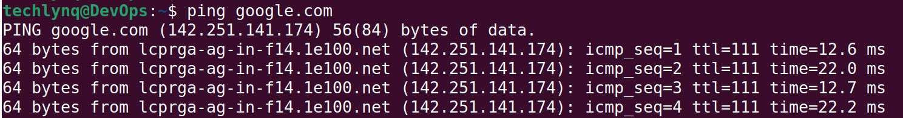

If you are seeing this error in Linux:

```text
Temporary failure in name resolution
```

it means your system is unable to convert domain names (such as google.com) into IP addresses.
This is a DNS (Domain Name System) issue—not necessarily an internet connectivity issue.
Even if your network connection is working, a DNS failure can make it appear as though everything is offline.

## Symptoms of This DNS Error

You may encounter this issue when:

- Running `apt update`
- Installing packages with `apt` or `dnf`
- Cloning repositories with Git
- Using `curl` or `wget`
- Accessing websites from the terminal

In these situations, Linux may be unable to resolve domain names such as `google.com`, `github.com`, or package repository servers.
If IP addresses work but domain names do not, DNS resolution is likely the problem.

## What Causes This Error?
This issue usually happens when:
- DNS servers are missing or misconfigured
- /etc/resolv.conf is broken or overwritten
- NetworkManager is not applying DNS settings correctly
- VPN or network changes have disrupted DNS routing
- A system reboot reset the DNS configuration
## Quick Test (Confirm the Problem)
First, check if raw internet works:
```bash
ping 8.8.8.8
```

Then try domain resolution:
```bash
ping google.com
```

If this fails:
If pinging an IP address works but pinging a domain name fails, you likely have a DNS resolution problem.

### Fix 1: Repair DNS Using /etc/resolv.conf
Open the DNS configuration file:
```bash
sudo nano /etc/resolv.conf
```

Add the following DNS servers:
```text
nameserver 8.8.8.8
nameserver 1.1.1.1
```

- 8.8.8.8 = Google DNS
- 1.1.1.1 = Cloudflare DNS

Save and exit.

### Fix 2: Restart NetworkManager
Apply the new DNS settings:

```bash
sudo systemctl restart NetworkManager
```

This forces Linux to reload network and DNS configuration.

### Fix 3: Test DNS Again
Run:
```bash
ping google.com
```

If everything is correct, you should now see replies like:



## Why This Happens (Simple Explanation)
Linux uses DNS configuration stored in:
```text
/etc/resolv.conf
```

When this file is:
- empty ❌
- overwritten ❌
- or misconfigured ❌
your system loses the ability to resolve domain names.

## Common Beginner Mistakes
### 1. Assuming it is a Wi-Fi issue
Even if Wi-Fi works, DNS can still fail.

### 2. ### 2. Only Testing Domain Names
Always test an IP address first:
```bash
ping 8.8.8.8
```

### 3. Forgetting NetworkManager restart
Changes in resolv.conf often don’t apply immediately.

## Summary
To fix “Temporary failure in name resolution”:

- Check internet with IP ping
- Fix /etc/resolv.conf
- Restart NetworkManager
- Test DNS again

Once DNS is restored, Linux networking returns to normal immediately.

## Related Linux Networking Guides
If you're troubleshooting Linux systems, these guides may also help:

- [How to Fix "No Such File or Directory" in Linux](/blog/linux/fix-no-such-file-or-directory-linux/)
- Fix Linux "Permission Denied" (Coming Soon)
- Fix "Command Not Found" in Linux (Coming Soon)
- Find Large Files Consuming Disk Space (Coming Soon)